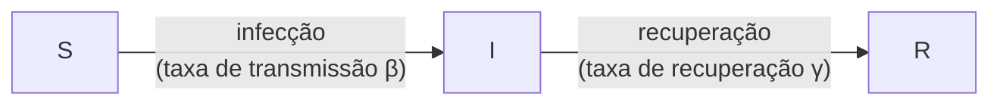

::: {.callout-note title="Perguntas"}

- O que é uma matriz de contato?
- Como as matrizes de contato são estimadas?
- Como as matrizes de contato são usadas na análise epidemiológica?

:::

::: {.callout-tip title="Objetivos"}

- Usar o pacote R `socialmixr` para estimar uma matriz de contato
- Compreender os diferentes tipos de análise em que as matrizes de contato podem ser usadas

:::

<!-- ::::::::::::::::::::::::::::::::::::: prereq -->

<!-- ## Prerequisites -->

<!-- ::::::::::::::::::::::::::::::::: -->

## Introdução

Alguns grupos de indivíduos têm mais contatos do que outros; um estudante em idade escolar, por exemplo, tem em média muito mais contatos diários do que uma pessoa idosa. Essa heterogeneidade nos padrões de contato entre diferentes grupos pode afetar a transmissão de doenças, pois determinados grupos têm maior probabilidade de transmitir para outros indivíduos dentro do mesmo grupo, bem como para outros grupos. A taxa na qual indivíduos dentro de grupos e entre grupos fazem contato com outros pode ser sintetizada em uma matriz de contato.

Neste tutorial, você vai aprender como as matrizes de contato podem ser usadas em diferentes análises, como o pacote `{contactsurveys}` pode ser usado para acessar dados de inquéritos de diferentes países e como o pacote `{socialmixr}` pode ser usado para estimar matrizes de contato. Usaremos `{dplyr}`, `{ggplot2}` e o pipe `%>%` para conectar algumas de suas funções; por isso, vamos carregar também o pacote `{tidyverse}`:

```{r,message=FALSE,warning=FALSE}
library(contactsurveys)
library(socialmixr)
library(wpp2024)
library(tidyverse)
```

## A matriz de contato

A matriz de contato básica representa a quantidade de contato ou de mistura dentro de diferentes subgrupos de uma população e entre eles. Os subgrupos são frequentemente faixas etárias, mas também podem ser:

- Áreas geográficas (por exemplo, diferentes regiões ou países)
- Grupos de risco (por exemplo, ocupações de alto/baixo risco)
- Ambientes sociais (por exemplo, domicílio, local de trabalho, escola)

Por exemplo, uma matriz de contato hipotética representando o número médio de contatos por dia entre crianças e adultos poderia ser:

$$
\begin{bmatrix}
2 & 2\\
1 & 3
\end{bmatrix}
$$

Neste exemplo, usamos isso para representar que crianças encontram, em média, outras 2 crianças e 2 adultos por dia (primeira linha), e adultos encontram, em média, 1 criança e outros 3 adultos por dia (segunda linha). Podemos usar esse tipo de informação para levar em conta o papel que a heterogeneidade nos contatos desempenha na transmissão de doenças infecciosas.

::: {.callout-note}

### Uma nota sobre notação

Em uma matriz de contato, o elemento $C[i,j]$, na linha $i$ e coluna $j$:

- Representa o número médio de contatos que um indivíduo do grupo $i$ tem com indivíduos do grupo $j$
- É calculado dividindo o número total de contatos entre os grupos $i$ e $j$ pelo tamanho do grupo $i$

:::

## Usando o `socialmixr`

As matrizes de contato são comumente estimadas a partir de estudos que utilizam diários para registrar interações. Por exemplo, o inquérito POLYMOD mediu padrões de contato em 8 países europeus utilizando dados sobre o local e a duração dos contatos relatados pelos participantes do estudo [(Mossong et al. 2008)](https://doi.org/10.1371/journal.pmed.0050074).

O pacote R `{socialmixr}` contém funções capazes de estimar matrizes de contato a partir do POLYMOD e de outros inquéritos. Podemos baixar e carregar os dados do inquérito POLYMOD diretamente do Zenodo usando `{contactsurveys}` e `{socialmixr}`:

```{r polymod_, echo = TRUE, message = FALSE, warning = FALSE}
survey_files <- contactsurveys::download_survey(
  survey = "https://doi.org/10.5281/zenodo.3874557",
  verbose = FALSE
)

survey_load <- socialmixr::load_survey(files = survey_files)
```

::: {.callout-note}

### Inspecionar os países disponíveis

Um único arquivo de inquérito pode conter dados de vários países. Você pode inspecionar os países disponíveis com:

```{r polymod_countries, echo = TRUE}
levels(survey_load$participants$country)
```

:::

Obtemos a matriz de contato para o Reino Unido passando `countries = "United Kingdom"` para selecionar os dados do país desejado, `age_limits` para definir as faixas etárias e `survey_pop` para fornecer a estrutura populacional de `{wpp2024}` exigida pelo `{socialmixr}`.

::: {.callout-note title="No Brasil: de onde tirar a estrutura populacional"}

O `{wpp2024}` traz as projeções da ONU, que servem para qualquer país. Para usar a população
brasileira por faixa etária — nacional, estadual ou municipal —, o caminho é o Censo e as
estimativas/projeções do IBGE, publicadas pelo DATASUS ([População residente — DATASUS](https://datasus.saude.gov.br/populacao-residente/)). Há também o pacote
`{microdatasus}`, que baixa esses microdados direto para o R ([microdatasus (CRAN)](https://cran.r-project.org/package=microdatasus)).

:::

```{r polymod_uk, echo = TRUE}
data(popAge1dt, package = "wpp2024")

uk_pop <- popAge1dt %>%
  dplyr::filter(name == "United Kingdom", year == 2020) %>%
  dplyr::select(lower.age.limit = age, population = pop) %>%
  dplyr::mutate(population = population * 1000)

contacts_byage <- socialmixr::contact_matrix(
  survey = survey_load,
  countries = "United Kingdom",
  age_limits = c(0, 20, 40),
  symmetric = TRUE,
  survey_pop = uk_pop
)
contacts_byage
```

### Matrizes de contato simétricas

Embora a matriz de contato `contacts_byage$matrix` não seja matematicamente simétrica em si, ela satisfaz a condição de que o número total de contatos de um grupo com outro seja igual ao inverso.

Em outras palavras:
`contacts_byage$matrix[j,i]*contacts_byage$demography$proportion[j] = contacts_byage$matrix[i,j]*contacts_byage$demography$proportion[i]`.

```{r}
contacts_byage$matrix * contacts_byage$demography$population
```

Para a explicação matemática, veja o exemplo prático abaixo.

::: {.callout-note title="Detalhes" collapse="true"}

### Exemplo prático

Relembre a matriz de contato hipotética apresentada anteriormente, representando o número médio de contatos por dia entre crianças e adultos:

$$
C =
\begin{bmatrix}
2 & 2\\
1 & 3
\end{bmatrix}
$$

ou seja, uma criança tem, em média, 2 contatos com outras crianças e 2 contatos com adultos por dia; um adulto tem, em média, 1 contato com crianças e 3 contatos com outros adultos por dia. Suponha que a população de crianças seja $N_{child} = x$ e a população de adultos seja $N_{adult} = 3x$.

Para obter o número total de contatos, redistribuímos o número médio de contatos pelo tamanho da população de cada grupo: $T_{ij} = m_{ij} N_i$

$$
T =
\begin{bmatrix}
2 \times x & 2 \times x\\
1 \times 3x & 3 \times 3x
\end{bmatrix}
=
\begin{bmatrix}
2x & 2x\\
3x & 9x
\end{bmatrix}
$$

Em princípio, o número total de contatos deveria ser o mesmo em ambas as direções, isto é, $T_{1,2} = T_{2,1}$. Aqui, $T_{1,2} = 2x$, mas $T_{2,1} = 3x$: eles divergem, de modo que este exemplo ilustrativo *não* é recíproco — exatamente a situação descrita acima, em que a variação amostral faz com que esses totais normalmente não coincidam com exatidão.

$T_{1,2}$ e $T_{2,1}$ são duas 'medições' diferentes e com ruído do mesmo número subjacente de eventos de contato entre crianças e adultos — uma relatada a partir das crianças e outra a partir dos adultos. Nenhuma das duas é isoladamente mais confiável que a outra. Assim como calculamos a média de medições repetidas de uma grandeza para aproximar seu valor verdadeiro, combinamos os dois totais e calculamos a média deles:

$$
\frac{T_{1,2}+T_{2,1}}{2} = \frac{2x+3x}{2} = 2.5x
$$

Esse valor combinado, $2.5x$, é nossa melhor estimativa pontual do número total verdadeiro (simétrico) de contatos entre os dois grupos — o mesmo valor independentemente da direção de onde partimos. Para convertê-lo novamente em uma taxa per capita, dividimos pelo tamanho populacional do grupo que *relatou* para cada direção:

$$
m'_{1,2} = \frac{2.5x}{N_{child}} = \frac{2.5x}{x} = 2.5 \qquad\qquad m'_{2,1} = \frac{2.5x}{N_{adult}} = \frac{2.5x}{3x} = \frac{5}{6}
$$

No nível dos contatos totais, isso resulta na matriz simétrica

$$
T' =
\begin{bmatrix}
2x & 2.5x\\
2.5x & 9x
\end{bmatrix}
$$

e, convertida de volta em taxas per capita, na matriz de contato simetrizada

$$
C' =
\begin{bmatrix}
2 & 2.5\\
5/6 & 3
\end{bmatrix}
$$

Esse procedimento de combinar e redistribuir é expresso como uma fórmula única [na seção correspondente da documentação do `socialmixr`](https://epiforecasts.io/socialmixr/articles/socialmixr.html#symmetric-contact-matrices).

:::

::: {.callout-note}

### Por que uma matriz de contato seria não simétrica?

Um dos argumentos que fornecemos à função `contact_matrix()` é `symmetric=TRUE`. Isso garante que o número total de contatos de um grupo com outro seja igual ao total do segundo grupo de volta para o primeiro (consulte a [vinheta](https://cran.r-project.org/web/packages/socialmixr/vignettes/socialmixr.html) do `socialmixr` para mais detalhes).

No entanto, quando as matrizes de contato são estimadas a partir de inquéritos ou de outras fontes, o número de contatos *relatado* pode diferir entre faixas etárias por diversas razões:

- Viés de memória (recall bias): diferentes faixas etárias podem ter capacidades distintas de lembrar e relatar contatos com precisão
- Viés de relato (reporting bias): alguns grupos podem supernotificar ou subnotificar sistematicamente seus contatos
- Incerteza amostral: tamanhos amostrais limitados podem levar a variações estatísticas
[(Prem et al. 2021)](https://doi.org/10.1371/journal.pcbi.1009098)

Se `symmetric` for definido como TRUE, a função `contact_matrix()` usará internamente uma média dos contatos relatados para garantir que os totais resultantes de contatos sejam simétricos.

:::

## Encontrar mais inquéritos por DOI

O exemplo acima utiliza o inquérito POLYMOD. Outros inquéritos estão disponíveis na comunidade [Zenodo Social Contact Data](https://zenodo.org/communities/social_contact_data/).

Para usar um inquérito diferente, identifique primeiro o seu DOI. Navegue pelos inquéritos disponíveis na comunidade [Zenodo Social Contact Data](https://zenodo.org/communities/social_contact_data/) ou liste-os programaticamente com `contactsurveys::list_surveys()`:

```{r,message=FALSE,warning=FALSE}
library(contactsurveys)
library(tidyverse)

# Obter a URL para os dados do inquérito de contato da Zâmbia a partir de {contactsurveys}
contactsurveys::list_surveys() %>%
  dplyr::filter(stringr::str_detect(title, "Zambia")) %>%
  dplyr::pull(url)
```

Em seguida, baixe e carregue o inquérito com `contactsurveys::download_survey()` e `socialmixr::load_survey()`. Aqui usamos o inquérito de contato da Zâmbia e da África do Sul:

```{r, message = FALSE, warning = FALSE}
# Baixar e carregar do Zenodo os dados do inquérito de contato da Zâmbia
survey_files_zambia <- contactsurveys::download_survey(
  survey = "https://doi.org/10.5281/zenodo.3874675",
  verbose = FALSE
)

survey_load_zambia <- socialmixr::load_survey(files = survey_files_zambia)
```

::: {.callout-tip .desafio title="Desafio"}

## Matriz de contato da Zâmbia

O pacote R {socialmixr} contém funções capazes de estimar matrizes de contato a partir do POLYMOD e de outros inquéritos. As saídas incluem informações demográficas, como o tamanho da população e o número de participantes no estudo. Usando o {socialmixr}:

+ Acesse o inquérito da Zâmbia.
+ Gere uma matriz de contato simétrica para a Zâmbia usando as seguintes faixas etárias:

    + [0,20)
    + 20+

+ Acesse o vetor com o tamanho da `population` por faixa etária a partir do conjunto de dados `demography` dentro da saída da matriz de contato.

::: {.callout-note title="Dica" collapse="true"}

O objeto de inquérito `survey_load_zambia` contém dados de dois países. Se você precisa estimar a matriz de contato social a partir dos dados do país específico Zâmbia, identifique qual argumento em `socialmixr::contact_matrix()` é necessário para isso.

```{r}
# Inspecionar os países dentro do objeto do inquérito
levels(survey_load_zambia$participants$country)
```

De forma semelhante ao código acima, para acessar valores de um vetor dentro de um dataframe, você pode usar o operador de cifrão: `$`

:::

:::

::: {.callout-important title="Para o instrutor" collapse="true"}

```{r zambia_solution}
data(popAge1dt, package = "wpp2024")

zambia_pop <- popAge1dt %>%
  dplyr::filter(name == "Zambia", year == 2020) %>%
  dplyr::select(lower.age.limit = age, population = pop) %>%
  dplyr::mutate(population = population * 1000)

# Gerar a matriz de contato apenas para a Zâmbia
contacts_byage_zambia <- socialmixr::contact_matrix(
  survey = survey_load_zambia,
  countries = "Zambia", # key argument
  age_limits = c(0, 20),
  symmetric = TRUE,
  survey_pop = zambia_pop
)

# Imprimir a matriz de contato apenas para a Zâmbia
contacts_byage_zambia

# Imprimir o vetor com o tamanho da população para o {epidemics}
contacts_byage_zambia$demography$population
```

:::

::: {.callout-note}

## Matrizes de contato sintéticas

As matrizes de contato podem ser estimadas a partir de dados obtidos por diários (como o POLYMOD), inquéritos ou dados de contato, ou matrizes sintéticas podem ser utilizadas. [Prem et al. 2021](https://doi.org/10.1371/journal.pcbi.1009098) utilizaram os dados do POLYMOD em um modelo hierárquico bayesiano para projetar matrizes de contato para outros 177 países.

::: {.callout-note title="No Brasil: não existe inquérito de contato brasileiro aqui"}

A coleção consultada pelo `{contactsurveys}` não tem nenhum inquérito brasileiro: em 20/09/2026 a
`contactsurveys::list_surveys()` devolvia 48 inquéritos depositados, todos de outros países.

Na prática, isso significa que quem modela o Brasil precisa escolher uma matriz de contato
justificada — sintética, adaptada de outro país ou de um inquérito próprio — e não uma matriz
medida na população brasileira. Registre essa escolha junto com a análise: ela muda o resultado.

:::

:::

## Análises com matrizes de contato

As matrizes de contato podem ser usadas em uma ampla variedade de análises epidemiológicas; elas podem ser utilizadas:

+ para calcular o número básico de reprodução levando em conta diferentes taxas de contato entre faixas etárias [(Funk et al. 2019)](https://doi.org/10.1186/s12916-019-1413-7),
+ para calcular o tamanho final de uma epidemia, como no pacote R `{finalsize}`,
+ para avaliar o impacto de intervenções, encontrando a mudança relativa entre as matrizes de contato pré e pós-intervenção para calcular a diferença relativa em $R_0$ [(Jarvis et al. 2020)](https://doi.org/10.1186/s12916-020-01597-8),
+ e em modelos matemáticos de transmissão dentro de uma população, para levar em conta padrões de contato específicos de cada grupo.

No entanto, todas essas aplicações exigem que façamos alguns cálculos adicionais utilizando a matriz de contato. Especificamente, há dois cálculos principais que frequentemente precisamos fazer:

### 1. Converter a matriz de contato no número esperado de casos secundários

Se os contatos variam entre os grupos, então o número médio de casos secundários não será simplesmente igual ao número médio de contatos multiplicado pela probabilidade de transmissão por contato. Isso ocorre porque a quantidade média de transmissão em cada geração de infecção não depende apenas de com quem um grupo entrou em contato; depende de com quem *os contatos desse grupo* subsequentemente entram em contato.

A função `r_eff()` do pacote `{finalsize}` pode realizar essa conversão, recebendo uma matriz de contato, a demografia e a proporção de suscetíveis, e convertendo-as em uma estimativa do número médio de casos secundários gerados por um indivíduo infeccioso típico (ou seja, o número efetivo de reprodução).

### 2. Converter a matriz de contato em taxas de contato

Enquanto uma matriz de contato fornece o número médio de contatos que um grupo faz com outro, a dinâmica epidêmica em diferentes grupos depende da taxa com que um grupo infecta o outro. Portanto, precisamos escalonar a taxa de interação entre diferentes grupos (ou seja, o número de contatos por unidade de tempo) para obter a taxa de transmissão.

Contudo, precisamos ter cuidado para definir corretamente em qualquer modelo a transmissão de e para cada grupo. Especificamente, o elemento $(i,j)$ na matriz de contato de um modelo matemático representa os contatos do grupo $i$ com o grupo $j$. Mas se quisermos saber a taxa com que o grupo $i$ está sendo infectado, precisamos multiplicar o número de contatos de suscetíveis do grupo $i$ ($S_i$) com o grupo $j$ ($C[i,j]$) pela proporção desses contatos que são infecciosos ($I_j/N_j$) e pelo risco de transmissão por contato ($\beta$).

::: {.callout-note}

### Por que transpormos a matriz de contato para obter taxas de contato

Relembre em **Uma nota sobre notação**, acima, que o elemento $C[i,j]$ da matriz gerada por `socialmixr::contact_matrix()` é lido sob a perspectiva do participante: o número médio de contatos que um participante do grupo $i$ relata ter com pessoas do grupo $j$.

Para converter isso em uma *taxa* de contato, lemos a matriz no sentido inverso: "suscetíveis no grupo $i$ ($S_i$), *contatados pelo* grupo $j$". Trata-se do mesmo contato visto sob a perspectiva do suscetível, em vez da perspectiva de quem relata — o grupo $j$ está fazendo o contato, e o grupo $i$ está sendo exposto. Em outras palavras, o elemento que precisamos na posição $(i,j)$ é o contato relatado na posição $(j,i)$ do `socialmixr`: as duas convenções são transpostas uma da outra.

Passar de uma convenção para outra significa transpor a matriz. Alguns pacotes esperam que você faça isso manualmente; o `{epidemics}` faz isso por você.

A partir da versão 0.5.0, as funções de modelo do `{epidemics}` transpõem a matriz de contato internamente; portanto, uma matriz de `socialmixr::contact_matrix()` deve ser passada para `epidemics::population()` exatamente como é retornada, sem nenhuma chamada a `t()`:

```r
contacts_byage_matrix <- contacts_byage$matrix
```

Internamente, é a matriz transposta que é usada como $C_{i,j}$ em $\beta S_i \sum_j C_{i,j} I_j/N_j$ abaixo.

:::

### Em modelos matemáticos

Considere o modelo SIR em que os indivíduos são categorizados como suscetíveis $S$, infectados $I$ ou recuperados $R$. O esquema abaixo mostra os processos que descrevem o fluxo de indivíduos entre os estados de doença $S$, $I$ e $R$ e os parâmetros fundamentais de cada processo.



As [equações diferenciais](../glossario.qmd#ordinary) abaixo descrevem como os indivíduos passam de um estado para outro [(Bjørnstad et al. 2020)](https://doi.org/10.1038/s41592-020-0822-z).

$$
\begin{aligned}
\frac{dS}{dt} & = - \beta S I /N \\
\frac{dI}{dt} &= \beta S I /N - \gamma I \\
\frac{dR}{dt} &=\gamma I \\
\end{aligned}
$$

Para adicionar estrutura etária ao nosso modelo, precisamos acrescentar equações adicionais para os estados de infecção $S$, $I$ e $R$ para cada faixa etária $i$. Se quisermos assumir que há heterogeneidade nos contatos entre as faixas etárias, devemos adaptar o termo de transmissão $\beta SI$ para incluir a matriz de contato $C$ da seguinte forma:

$$ \beta S_i \sum_j C_{i,j} I_j/N_j. $$

Indivíduos suscetíveis na faixa etária $i$ tornam-se infectados em função da sua taxa de contato com indivíduos de cada faixa etária. Para cada estado de doença ($S$, $I$ e $R$) e faixa etária ($i$), temos uma equação diferencialdescrevendo a taxa de variação em relação ao tempo.

$$
\begin{aligned}
\frac{dS_i}{dt} & = - \beta S_i \sum_j C_{i,j} I_j/N_j \\
\frac{dI_i}{dt} &= \beta S_i\sum_j C_{i,j} I_j/N_j - \gamma I_i \\
\frac{dR_i}{dt} &=\gamma I_i \\
\end{aligned}
$$

## Resumo

Neste tutorial, você aprendeu a definição de matriz de contato, como elas são estimadas e como acessar dados de contatos sociais usando `{contactsurveys}` e `{socialmixr}`. No próximo tutorial, você vai aprender como usar o pacote R `{epidemics}` para gerar trajetórias de doenças a partir de modelos matemáticos, com matrizes de contato usando o `socialmixr`.

::: {.callout-note title="Pontos-chave"}

- As matrizes de contato quantificam os padrões de mistura entre diferentes grupos populacionais
- O `socialmixr` fornece ferramentas para estimar matrizes de contato a partir de dados de inquéritos
- As matrizes de contato podem ser usadas em diversas análises epidemiológicas, desde o cálculo de $R_0$ até a modelagem de intervenções

:::
