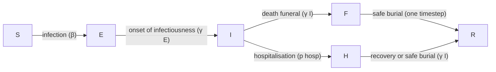

```{r setup, echo = FALSE, message = FALSE, warning = FALSE}
library(epidemics)
library(dplyr)
library(ggplot2)

# semente oculta para saída estocástica estável na aula
set.seed(33)
```

::: {.callout-note title="Perguntas"}

- Como escolher um modelo matemático adequado para cumprir minha tarefa analítica?

:::

::: {.callout-tip title="Objetivos"}

- Entender os requisitos do modelo para uma pergunta de pesquisa específica

:::

::: {.callout-important title="Pré-requisitos"}

+ Concluir o tutorial [Simular a transmissão](02-simular-transmissao.qmd)

:::

## Introdução

Existem modelos matemáticos para diferentes infecções, intervenções e padrões de transmissão que podem ser usados para responder a novas perguntas. Neste tutorial, você aprenderá a escolher um modelo existente para realizar uma determinada tarefa.

::: {.callout-important title="Para o instrutor" collapse="true"}

O foco deste tutorial é compreender os modelos existentes para decidir se eles são adequados para uma pergunta definida.

:::

::: {.callout-note title="Discussão"}

### Escolher um modelo

Ao decidir qual modelo matemático utilizar, há uma série de perguntas que você deve considerar:

:::

::: {.callout-note .solucao title="Solução" collapse="true"}

### Qual é a infecção/doença de interesse?

Pode ser que já exista um modelo para a doença do seu estudo, ou pode haver um modelo para uma infecção com vias de transmissão e características epidemiológicas semelhantes que possa ser adaptado. Por exemplo, doenças com vias de transmissão semelhantes (por exemplo, transmissão pelo ar, por gotículas ou por contato) e história natural semelhante (por exemplo, período de incubação, período infeccioso) podem usar estruturas de modelo semelhantes.

:::

::: {.callout-note .solucao title="Solução" collapse="true"}

### Precisamos de um modelo [determinístico](../glossario.qmd#deterministic) ou [estocástico](../glossario.qmd#stochastic)?

As estruturas dos modelos diferem dependendo da escala e da natureza do surto. Quando o número simulado de infecções é pequeno, a variação estocástica (ou seja, a aleatoriedade que podemos definir matematicamente) na saída pode afetar significativamente se um surto vai se disseminar ou não. Surtos, que são tipicamente eventos localizados, podem ser melhor modelados usando abordagens estocásticas para capturar a incerteza na dinâmica inicial de transmissão. Epidemias, que são eventos de maior escala, muitas vezes podem ser modeladas eficazmente usando abordagens determinísticas, já que a variação estocástica se torna menos significativa em relação à dinâmica geral. É importante notar que os termos "surto" e "epidemia" às vezes podem ser usados de forma intercambiável dependendo do contexto, com surtos sendo por vezes considerados como epidemias localizadas.

:::

::: {.callout-note .solucao title="Solução" collapse="true"}

## Qual é o desfecho de interesse?

O desfecho de interesse é tipicamente uma quantidade mensurável derivada do modelo matemático. Isso pode incluir:

- O número de infecções ao longo do tempo
- O número de internações no pico
- O número total de casos graves da doença

::: {.callout-note title="No Brasil: onde ficam os desfechos graves"}

Casos graves e internações por SRAG estão no **SIVEP-Gripe**, com base aberta ([Portal de Dados Abertos do SUS — SIVEP-Gripe](https://dadosabertos.saude.gov.br/dataset/srag-2019-a-2026)); internações
por outros agravos aparecem no **SIH/SUS**, também no DATASUS. São essas as bases que alimentam a
pergunta "quantos casos graves e quantas internações este cenário produz?".

:::
- O tamanho final da epidemia
- O momento dos picos epidêmicos

:::

::: {.callout-note .solucao title="Solução" collapse="true"}

## Como a transmissão é modelada?

Por exemplo, [direta](../glossario.qmd#direct) ou [indireta](../glossario.qmd#indirect), [pelo ar](../glossario.qmd#airborne) ou [por vetores](../glossario.qmd#vectorborne).

:::

::: {.callout-note .solucao title="Solução" collapse="true"}

## Como os diferentes processos (por exemplo, transmissão) são formulados nas equações?

Pode haver diferenças sutis nas estruturas dos modelos para a mesma infecção ou tipo de surto que podem passar despercebidas sem o estudo das equações. Por exemplo, os parâmetros de transmissibilidade podem ser especificados como taxas ou probabilidades. Se você quiser usar valores de parâmetros de outros modelos publicados, deve verificar se a transmissão está formulada da mesma maneira.

:::

::: {.callout-note .solucao title="Solução" collapse="true"}

## Alguma intervenção será modelada?

Por fim, intervenções como vacinação, distanciamento social ou programas de tratamento podem ser de interesse. Diferentes modelos têm capacidades variadas para incorporar intervenções:

- Alguns modelos podem simular intervenções contínuas (por exemplo, programas contínuos de vacinação)

::: {.callout-note title="No Brasil: vacinação contínua e campanhas"}

O Programa Nacional de Imunizações (PNI) combina **vacinação de rotina**, ao longo do ano, com
**campanhas** de período definido. São dois formatos de intervenção diferentes: uma taxa de
vacinação constante (rotina) e uma taxa concentrada em uma janela curta (campanha).

:::
- Outros lidam com intervenções discretas (por exemplo, fechamento pontual de escolas)
- Alguns modelos podem não incluir capacidades de intervenção

Discutimos intervenções em detalhes no tutorial [Modelar intervenções](04-modelar-intervencoes.qmd).

:::

## Modelos disponíveis no `{epidemics}`

O pacote de R `{epidemics}` contém funções para executar modelos existentes.
Para mais detalhes sobre os modelos disponíveis, consulte o [Guia de Referência de "Model functions"](https://epiverse-trace.github.io/epidemics/reference/index.html#model-functions) do pacote. Todos os nomes de funções de modelos começam com `model_*()`. Para aprender a executar os modelos no R, leia as [Vignettes em "Guides to library models"](https://epiverse-trace.github.io/epidemics/articles/#guides-to-library-models).

::: {.callout-tip .desafio title="Desafio"}

## Qual modelo?

Foi solicitado a você que explore a variação no número de indivíduos infecciosos nos estágios iniciais de um surto de Ebola.

Qual dos seguintes modelos seria uma escolha adequada para essa tarefa:

+ `model_default()`

+ `model_ebola()`

::: {.callout-note title="Dica" collapse="true"}

Considere as seguintes perguntas:

::: {.callout-note title="Checklist"}

+ Qual é a infecção/doença de interesse?
+ Precisamos de um modelo determinístico ou estocástico?
+ Qual é o desfecho de interesse?
+ Alguma intervenção será modelada?

:::

:::

::: {.callout-note .solucao title="Solução" collapse="true"}

+ Qual é a infecção/doença de interesse? **Ebola**
+ Precisamos de um modelo determinístico ou estocástico? **Um modelo estocástico nos permitiria explorar a variação nos estágios iniciais do surto**
+ Qual é o desfecho de interesse? **Número de infecções**
+ Alguma intervenção será modelada? **Não**

#### `model_default()`

Um modelo SEIR determinístico com transmissão direta específica por faixa etária.


O modelo é capaz de simular um surto do tipo Ebola, mas, como é determinístico, não é possível explorar a variação estocástica nos estágios iniciais do surto.

#### `model_ebola()`

Um modelo estocástico SEIHFR (*Susceptible, Exposed, Infectious, Hospitalised, Funeral, Removed* — Suscetível, Exposto, Infeccioso, Hospitalizado, Funeral, Removido) desenvolvido especificamente para a doença pelo vírus Ebola. O modelo inclui compartimentos específicos para os estados Hospitalizado e Funeral, que são críticos para entender a dinâmica de transmissão do Ebola devido ao alto risco de transmissão em serviços de saúde e durante práticas tradicionais de sepultamento. O modelo apresenta estocasticidade nos tempos de transição entre estados, que são modelados como distribuições Erlang.

Os principais parâmetros que afetam a transição entre os estados são:

+ $R_0$, o número básico de reprodução,
+ $\rho^I$, o período infeccioso médio,
+ $\rho^E$, o período pré-infeccioso médio,
+ $p_{hosp}$, a probabilidade de transferência para o compartimento de hospitalizados.

**Nota:** a relação funcional entre o período pré-infeccioso ($\rho^E$) e a taxa de transição entre exposto e infeccioso ($\gamma^E$) é $\rho^E = k^E/\gamma^E$, em que $k^E$ é o parâmetro de forma da distribuição Erlang. Da mesma forma, para o período infeccioso, $\rho^I = k^I/\gamma^I$. Para mais detalhes sobre a formulação do modelo estocástico, consulte a seção [Discrete-time Ebola virus disease model](https://epiverse-trace.github.io/epidemics/articles/model_ebola.html#details-discrete-time-ebola-virus-disease-model) na vignette "Modelling responses to a stochastic Ebola virus epidemic".



O modelo possui parâmetros adicionais que descrevem o risco de transmissão em ambientes hospitalares e de sepultamento:

+ $p_{ETU}$, a proporção de casos hospitalizados que contribuem para a infecção de suscetíveis (ETU = *Ebola virus treatment units*, unidades de tratamento de Ebola),
+ $p_{funeral}$, a proporção de funerais nos quais o risco de transmissão é igual ao de indivíduos infecciosos na comunidade.

Como este modelo é estocástico, ele é a escolha mais adequada para explorar a variação no número de indivíduos infectados nos estágios iniciais de um surto de Ebola.

:::

:::

::: {.callout-note}
### Preciso usar um modelo matemático?

Modelos matemáticos podem ser usados para gerar trajetórias da doença, que podem então ser usadas para calcular o tamanho final da epidemia. Se o seu único interesse for o tamanho final, é possível usar a teoria matemática para calcular essa quantidade diretamente, sem precisar simular o modelo completo e depois calcular quantos indivíduos foram infectados. Esses cálculos matemáticos são realizados utilizando funções em R do pacote `{finalsize}`.

Uma vantagem de usar o `{finalsize}` é que são necessários menos parâmetros. Você só precisa definir a transmissibilidade e a suscetibilidade da população e, se for relevante, uma matriz de contato social, em vez de parâmetros como o período infeccioso, que são exigidos no `{epidemics}` para simular a dinâmica ao longo do tempo. Confira as [vignettes do pacote](https://epiverse-trace.github.io/finalsize/articles/finalsize.html) para obter mais informações sobre como usar o `{finalsize}` para calcular o tamanho da epidemia.

:::

## Desafio: análise de surto de Ebola

::: {.callout-tip .desafio title="Desafio"}

## Executar o modelo

Você foi encarregado de gerar trajetórias iniciais de um surto de Ebola na Guiné. Usando `model_ebola()` e as informações detalhadas abaixo, conclua as seguintes tarefas:

1. Execute o modelo uma vez e trace o gráfico do número de indivíduos infecciosos ao longo do tempo
2. Execute o modelo 100 vezes e trace o gráfico da média e dos quantis superior e inferior de 95% do número de indivíduos infecciosos ao longo do tempo

+ Tamanho da população: 14 milhões
+ Número inicial de indivíduos expostos: 10
+ Número inicial de indivíduos infecciosos: 5
+ Tempo de simulação: 120 dias+ Valores dos parâmetros:
  + $R_0$ (`r0`) = 1.1,
  + $p^I$ (`infectious_period`) = 12,  + $p^E$ (`preinfectious_period`) = 5,
  + $k^E=k^I = 2$,
  + $1-p_{hosp}$ (`prop_community`) = 0.9,
  + $p_{ETU}$ (`etu_risk`) = 0.7,
  + $p_{funeral}$ (`funeral_risk`) = 0.5

::: {.callout-note title="Dica" collapse="true"}

### Código para as condições iniciais

```{r}
# definir o tamanho da população
population_size <- 14e6

E0 <- 10
I0 <- 5
# preparar condições iniciais como proporções
initial_conditions <- c(
  S = population_size - (E0 + I0), E = E0, I = I0, H = 0, F = 0, R = 0
) / population_size

guinea_population <- population(
  name = "Guinea",
  contact_matrix = matrix(1), # nota: valor fictício
  demography_vector = population_size, # 14 milhões, sem faixas etárias
  initial_conditions = matrix(
    initial_conditions,
    nrow = 1
  )
)
```

:::

::: {.callout-note title="Dica" collapse="true"}

### DICA: Simulações múltiplas do modelo

Adapte o código da seção [levar em conta a incerteza](02-simular-transmissao.qmd#accounting-for-uncertainty)

:::

::: {.callout-note .solucao title="Solução" collapse="true"}

1. Execute o modelo uma vez e trace o gráfico do número de indivíduos infecciosos ao longo do tempo

```{r}
output <- model_ebola(
  population = guinea_population,
  transmission_rate = 1.1 / 12,
  infectiousness_rate = 2.0 / 5,
  removal_rate = 2.0 / 12,
  prop_community = 0.9,
  etu_risk = 0.7,
  funeral_risk = 0.5,
  time_end = 100,
  replicates = 1 # argumento replicates
)

output %>%
  filter(compartment == "infectious") %>%
  ggplot() +
  geom_line(
    aes(time, value),
    linewidth = 1.2
  ) +
  scale_y_continuous(
    labels = scales::comma
  ) +
  labs(
    x = "Simulation time (days)",
    y = "Individuals"
  ) +
  theme_bw(
    base_size = 15
  )
```

2. Execute o modelo 100 vezes e trace o gráfico da média e dos quantis superior e inferior de 95% do número de indivíduos infecciosos ao longo do tempo

Executamos o modelo 100 vezes com os *mesmos* valores de parâmetros.

```{r}
output_replicates <- model_ebola(
  population = guinea_population,
  transmission_rate = 1.1 / 12,
  infectiousness_rate = 2.0 / 5,
  removal_rate = 2.0 / 12,
  prop_community = 0.9,
  etu_risk = 0.7,
  funeral_risk = 0.5,
  time_end = 100,
  replicates = 100 # argumento replicates
)

output_replicates %>%
  filter(compartment == "infectious") %>%
  ggplot(
    aes(time, value)
  ) +
  stat_summary(geom = "line", fun = mean) +
  stat_summary(
    geom = "ribbon",
    fun.min = function(z) {
      quantile(z, 0.025)
    },
    fun.max = function(z) {
      quantile(z, 0.975)
    },
    alpha = 0.3
  ) +
  labs(
    x = "Simulation time (days)",
    y = "Individuals"
  ) +
  theme_bw(
    base_size = 15
  )
```

:::

:::

::: {.callout-note title="Pontos-chave"}

- Modelos matemáticos existentes devem ser selecionados de acordo com a pergunta de pesquisa
- É importante verificar se o modelo possui pressupostos adequados sobre transmissão, potencial de surto, desfechos e intervenções

:::
