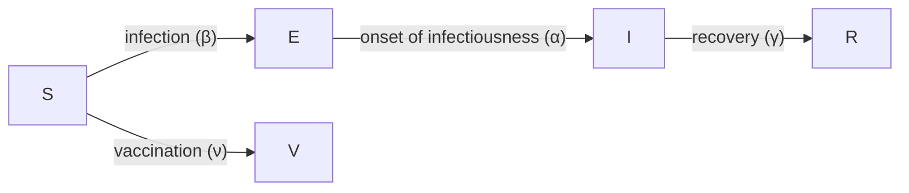

```{r setup, echo= FALSE, message = FALSE, warning = FALSE}
library(ggplot2)
library(epidemics)
```

::: {.callout-note title="Perguntas"}

- Como investigar o efeito de intervenções nas trajetórias da doença?

:::

::: {.callout-tip title="Objetivos"}

- Adicionar intervenções farmacológicas e não farmacológicas a modelos do `{epidemics}`

:::

::: {.callout-important title="Pré-requisitos"}

+ Concluir o tutorial sobre [Simular a transmissão](02-simular-transmissao.qmd).

Você também deve se familiarizar com os seguintes conceitos antes de trabalhar neste tutorial:

**Resposta a surtos**: [Tipos de intervenção](https://www.cdc.gov/nonpharmaceutical-interventions/).

**Pacotes de R instalados**: `{epidemics}`, `{contactsurveys}`, `{socialmixr}`, `{wpp2024}`, `{scales}`, `{tidyverse}`.

:::

::: {.callout-note title="Detalhes" collapse="true"}

Instale os pacotes se eles ainda não estiverem instalados (você pode configurar o espelho brasileiro do CRAN com `options(repos = c(CRAN = "https://cran-r.c3sl.ufpr.br/"))`):

```r
if (!base::require("pak")) install.packages("pak")
pak::pak(c("epiverse-trace/epidemics", "PPgp/wpp2024", "contactsurveys", "socialmixr", "scales", "tidyverse"))
```

Se encontrar alguma mensagem de erro,
acesse a [página principal de configuração](../setup.qmd#software-setup).

:::

## Introdução

Modelos matemáticos podem ser usados para gerar trajetórias da propagação de doenças sob a implementação de intervenções em diferentes estágios de um surto. Essas trajetórias podem ser usadas para tomar decisões sobre quais intervenções poderiam ser implementadas para desacelerar a propagação de doenças.

As intervenções costumam ser incorporadas a modelos matemáticos manipulando os valores de parâmetros relevantes, por exemplo, reduzindo a transmissão, ou introduzindo um novo estado da doença, por exemplo, uma classe de vacinados em que assumimos que os indivíduos pertencentes a essa classe não são mais suscetíveis à infecção.

Neste tutorial, aprenderemos a usar o `{epidemics}` para modelar intervenções e acessar dados de contatos sociais com o `{socialmixr}`. Usaremos o `{dplyr}`, o `{ggplot2}` e o pipe `%>%` para conectar algumas de suas funções, portanto vamos carregar também o `{tidyverse}`:

```{r,message=FALSE,warning=FALSE}
library(epidemics)
library(contactsurveys)
library(socialmixr)
library(wpp2024)
library(tidyverse)
```

::: {.callout-important title="Para o instrutor" collapse="true"}

Neste tutorial, diferentes tipos de intervenção e como modelá-los são apresentados. Os participantes devem ser capazes de compreender o mecanismo subjacente dessas intervenções (por exemplo, reduzir a taxa de contato), bem como implementar o código para incluir tais intervenções.

:::

::: {.callout-important title="Para o instrutor" collapse="true"}

Compartilhe com os participantes o código do modelo da linha de base.

Ele tem parâmetros de doença **diferentes** do episódio anterior.

Em seguida, comece a codificação ao vivo diretamente com as intervenções.

:::

## Modelo da linha de base

Investigaremos o efeito de intervenções em um surto de COVID-19 usando um modelo SEIR (`model_default()` no pacote de R `{epidemics}`). Para podermos observar o efeito da nossa intervenção, executaremos uma variante do modelo na linha de base, isto é, sem intervenção.

O modelo SEIR divide a população em quatro compartimentos: Suscetível (S), Exposto (E), Infeccioso (I) e Recuperado (R). Definiremos os seguintes parâmetros para o nosso modelo: $R_0 = 2.7$ (número básico de reprodução), período de latência ou período pré-infeccioso $= 4$ dias e período infeccioso $= 5.5$ dias (parâmetros adaptados de [Davies et al. (2020)](https://doi.org/10.1016/S2468-2667(20)30133-X)). Adotamos uma matriz de contato com faixas etárias de 0-15, 15-65 e 65 anos ou mais usando o `{socialmixr}`, e assumimos que um a cada 1 milhão de indivíduos em cada faixa etária está infeccioso no início da epidemia.

```{r model_setup, echo = TRUE, message = FALSE, warning = FALSE}
# baixar e carregar dados de inquérito
survey_files <- contactsurveys::download_survey(
  survey = "https://doi.org/10.5281/zenodo.3874557",
  verbose = FALSE
)
survey_load <- socialmixr::load_survey(files = survey_files)

data(popAge1dt, package = "wpp2024")

uk_pop <- popAge1dt %>%
  dplyr::filter(name == "United Kingdom", year == 2020) %>%
  dplyr::select(lower.age.limit = age, population = pop) %>%
  dplyr::mutate(population = population * 1000)

# gerar matriz de contato
contacts_byage <- socialmixr::contact_matrix(
  survey = survey_load,
  countries = "United Kingdom",
  age_limits = c(0, 15, 65),
  symmetric = TRUE,
  survey_pop = uk_pop
)

# preparar a matriz de contato
contacts_byage_matrix <- contacts_byage$matrix

# preparar o vetor de demografia
demography_vector <- contacts_byage$demography$population
names(demography_vector) <- rownames(contacts_byage_matrix)

# condições iniciais: um a cada 1 milhão está infectado
initial_i <- 1e-6
initial_conditions <- c(
  S = 1 - initial_i,
  E = 0,
  I = initial_i,
  R = 0,
  V = 0
)

# construir para todas as faixas etárias
initial_conditions <- base::rbind(
  initial_conditions,
  initial_conditions,
  initial_conditions
)
rownames(initial_conditions) <- rownames(contacts_byage_matrix)

# preparar a população a modelar como afetada pela epidemia
uk_population <- epidemics::population(
  name = "UK",
  contact_matrix = contacts_byage_matrix,
  demography_vector = demography_vector,
  initial_conditions = initial_conditions
)
```

Executamos o modelo com uma taxa de infecciosidade $= 1/4$, uma taxa de recuperação $= 1/5.5$ e uma taxa de transmissão $= 2.7/5.5$ (lembre-se de que [taxa de transmissão = $R_0$ * taxa de recuperação](02-simular-transmissao.qmd#the-basic-reproduction-number-r_0)) da seguinte forma:

```{r, echo = TRUE, message = FALSE}
# períodos de tempo
preinfectious_period <- 4.0
infectious_period <- 5.5
basic_reproduction <- 2.7

# taxas
infectiousness_rate <- 1.0 / preinfectious_period
recovery_rate <- 1.0 / infectious_period
transmission_rate <- basic_reproduction * recovery_rate

# executar simulação da linha de base sem intervenção
output_baseline <- epidemics::model_default(
  population = uk_population,
  transmission_rate = transmission_rate,
  infectiousness_rate = infectiousness_rate,
  recovery_rate = recovery_rate,
  time_end = 300, increment = 1.0
)
```

::: {.callout-important title="Para o instrutor" collapse="true"}

Faça uma pausa.

Use slides para introduzir os tópicos de:

- Intervenções não farmacológicas.

Em seguida, continue com a codificação ao vivo.

:::

## Intervenções não farmacológicas

::: {.callout-note title="No Brasil: quem decide sobre as NPIs"}

As intervenções não farmacológicas (fechamento de escolas, uso de máscaras, restrição de
circulação) foram adotadas no Brasil por **decretos estaduais e municipais**, com heterogeneidade
de conteúdo e de momento entre os entes — o que dificulta tratar o país como um cenário único.
O levantamento das medidas adotadas em 2020 está em [Aquino et al. (2020), *Ciência & Saúde Coletiva* 25(supl. 1)](https://www.scielosp.org/article/csc/2020.v25suppl1/2423-2446/pt/).

:::

[Intervenções não farmacológicas](../glossario.qmd#NPIs) (NPIs) são medidas implementadas para reduzir a transmissão que não incluem a administração de medicamentos ou vacinas. As NPIs visam reduzir os contatos entre indivíduos infecciosos e suscetíveis por meio do fechamento de escolas e locais de trabalho, e outras medidas para prevenir a propagação da doença, como lavar as mãos e usar máscaras.

### Efeito do fechamento de escolas na propagação da COVID-19

A primeira NPI que consideraremos é o efeito do fechamento de escolas na redução do número de indivíduos infectados com COVID-19 ao longo do tempo. Assumimos que o fechamento de escolas reduzirá a frequência de contatos dentro das faixas etárias e entre elas. Com base em estudos empíricos, assumimos que o fechamento de escolas reduzirá os contatos entre crianças em idade escolar (de 0 a 15 anos) em 50% e causará uma pequena redução (1%) nos contatos entre adultos (com 15 anos ou mais).

Para incluir uma intervenção em nosso modelo, devemos criar um objeto `intervention`. As entradas são o nome da intervenção (`name`), o tipo de intervenção (`contacts` ou `rate`), o tempo de início (`time_begin`), o tempo de término (`time_end`) e a redução (`reduction`). Os valores da matriz de redução são especificados na mesma ordem das faixas etárias na matriz de contato.

```{r}
rownames(contacts_byage_matrix)
```

Portanto, especificamos `reduction = matrix(c(0.5, 0.01, 0.01))`. Assumimos que o fechamento de escolas começa no dia 50 e permanece em vigor por mais 100 dias. Portanto, nosso objeto de intervenção é:

```{r intervention}
close_schools <- epidemics::intervention(
  name = "School closure",
  type = "contacts",
  time_begin = 50,
  time_end = 50 + 100,
  reduction = matrix(c(0.5, 0.01, 0.01))
)
```

::: {.callout-note}
### Efeito de intervenções nos contatos

No `{epidemics}`, a matriz de contato é reduzida proporcionalmente durante o período em que a intervenção está em vigor. Para entender como a redução é calculada nas funções do modelo, considere uma matriz de contato para duas faixas etárias com igual número de contatos:

```{r echo = FALSE}
reduction <- matrix(c(0.5, 0.1))
contact_matrix_example <- matrix(c(1, 1, 1, 1), nrow = 2)
contact_matrix_example
```

Se a redução for de 50% no grupo 1 e 10% no grupo 2, a matriz de contato durante a intervenção será:

```{r echo = FALSE}
contact_matrix_example[1, ] <- contact_matrix_example[1, ] * (1 - reduction[1])
contact_matrix_example[, 1] <- contact_matrix_example[, 1] * (1 - reduction[1])
contact_matrix_example[2, ] <- contact_matrix_example[2, ] * (1 - reduction[2])
contact_matrix_example[, 2] <- contact_matrix_example[, 2] * (1 - reduction[2])
contact_matrix_example
```

Os contatos dentro do grupo 1 são reduzidos em 50% duas vezes para contemplar uma redução de 50% nos contatos emitidos e recebidos ($1\times 0.5 \times 0.5 = 0.25$). De forma similar, os contatos dentro do grupo 2 são reduzidos em 10% duas vezes. Os contatos entre o grupo 1 e o grupo 2 são reduzidos em 50% e depois em 10% ($1 \times 0.5 \times 0.9= 0.45$).

:::

Executamos o modelo com `intervention = list(contacts = close_schools)` da seguinte forma:

```{r school}
output_school <- epidemics::model_default(
  # população
  population = uk_population,
  # taxa
  transmission_rate = transmission_rate,
  infectiousness_rate = infectiousness_rate,
  recovery_rate = recovery_rate,
  # intervenção
  intervention = list(contacts = close_schools),
  # tempo
  time_end = 300, increment = 1.0
)
```

Para observar o efeito da nossa intervenção, combinaremos as saídas da linha de base e da intervenção em um único data frame e, em seguida, traçaremos os resultados em um gráfico. Aqui traçamos o número total de indivíduos infecciosos em todas as faixas etárias usando a função `ggplot2::stat_summary()`:

```{r baseline, echo = TRUE, fig.width = 10}
# criar a coluna intervention_type para o gráfico
output_school$intervention_type <- "school closure"
output_baseline$intervention_type <- "baseline"
output <- base::rbind(output_school, output_baseline)

output %>%
  filter(compartment == "infectious") %>%
  ggplot() +
  aes(
    x = time,
    y = value,
    color = intervention_type,
    linetype = intervention_type
  ) +
  stat_summary(
    fun = "sum",
    geom = "line",
    linewidth = 1
  ) +
  scale_y_continuous(
    labels = scales::comma
  ) +
  geom_vline(
    xintercept = c(
      close_schools$time_begin,
      close_schools$time_end
    ),
    linetype = 2
  ) +
  theme_bw() +
  labs(
    x = "Simulation time (days)",
    y = "Individuals"
  )
```

Podemos observar que, com a intervenção em vigor, a infecção ainda se propaga pela população e, portanto, o acúmulo de imunidade contribui para o eventual padrão de pico e queda. No entanto, o pico no número de indivíduos infecciosos é menor (linha tracejada verde) do que na linha de base sem nenhuma intervenção em vigor (linha sólida vermelha), mostrando uma redução no número absoluto de casos.

### Efeito do uso de máscaras na propagação da COVID-19

Também podemos modelar o efeito de outras NPIs reduzindo o valor dos parâmetros relevantes. Por exemplo, investigando o efeito do uso de máscaras no número de indivíduos infectados com COVID-19 ao longo do tempo.

Esperamos que o uso de máscaras reduza a infecciosidade de um indivíduo, com base em múltiplos estudos que demonstram a eficácia das máscaras na redução da transmissão. Como estamos usando um modelo de base populacional, não podemos fazer alterações no comportamento individual e, portanto, assumimos que a taxa de transmissão $\beta$ é reduzida em uma proporção devido ao uso de máscaras na população. Especificamos essa proporção, $\theta$, como o produto da proporção que usa máscaras multiplicada pela proporção de redução na taxa de transmissão (adaptado de [Li et al. 2020](https://doi.org/10.1371/journal.pone.0237691)).

Criamos um objeto de intervenção com `type = "rate"` e `reduction = 0.163`. Usando parâmetros adaptados de [Li et al. 2020](https://doi.org/10.1371/journal.pone.0237691), temos proporção de uso de máscaras = cobertura $\times$ disponibilidade = $0.54 \times 0.525 = 0.2835$ e proporção de redução na taxa de transmissão = $0.575$. Portanto, $\theta = 0.2835 \times 0.575 = 0.163$. Assumimos que a obrigatoriedade do uso de máscaras começa no dia 40 e permanece em vigor por 200 dias.

```{r masks}
mask_mandate <- epidemics::intervention(
  name = "mask mandate",
  type = "rate",
  time_begin = 40,
  time_end = 40 + 200,
  reduction = 0.163
)
```

::: {.callout-note}
### Efeito da intervenção na taxa de transmissão

O valor de `reduction` reduz a escala da taxa de transmissão $\beta$ durante o período em que a intervenção está em vigor:

$$\beta \times (1 - \text{reduction})$$
$$\beta \times (1 - 0.163)$$
$$\beta \times 0.837$$

Se $\beta = 0.49$, então:

$$\beta_{\text{with intervention}} = 0.41$$

:::

Para implementar essa intervenção na taxa de transmissão $\beta$, especificamos `intervention = list(transmission_rate = mask_mandate)`.

```{r output_masks}
output_masks <- epidemics::model_default(
  # população
  population = uk_population,
  # taxa
  transmission_rate = transmission_rate,
  infectiousness_rate = infectiousness_rate,
  recovery_rate = recovery_rate,
  # intervenção
  intervention = list(transmission_rate = mask_mandate),
  # tempo
  time_end = 300, increment = 1.0
)
```

```{r plot_masks, echo = TRUE, message = FALSE, fig.width = 10}
# criar a coluna intervention_type para o gráfico
output_masks$intervention_type <- "mask mandate"
output_baseline$intervention_type <- "baseline"
output <- base::rbind(output_masks, output_baseline)

output %>%
  filter(compartment == "infectious") %>%
  ggplot() +
  aes(
    x = time,
    y = value,
    color = intervention_type,
    linetype = intervention_type
  ) +
  stat_summary(
    fun = "sum",
    geom = "line",
    linewidth = 1
  ) +
  scale_y_continuous(
    labels = scales::comma
  ) +
  geom_vline(
    xintercept = c(
      mask_mandate$time_begin,
      mask_mandate$time_end
    ),
    linetype = 2
  ) +
  theme_bw() +
  labs(
    x = "Simulation time (days)",
    y = "Individuals"
  )
```

::: {.callout-note}
### Tipos de intervenção

Existem dois tipos de intervenção para `model_default()`: intervenções de taxa nos parâmetros do modelo (`transmission_rate` $\beta$, `infectiousness_rate` $\sigma$ e `recovery_rate` $\gamma$) e reduções na matriz de contato (`contacts`).

Para implementar intervenções de contato e de taxa na mesma simulação, elas devem ser passadas como uma lista, por exemplo, `intervention = list(transmission_rate = mask_mandate, contacts = close_schools)`. Mas se houver múltiplas intervenções voltadas para taxas de contato, elas devem ser passadas como uma única entrada em `contacts`. Consulte a [vinheta sobre modelagem de intervenções sobrepostas](https://epiverse-trace.github.io/epidemics/articles/modelling_multiple_interventions.html) para mais detalhes.

:::

::: {.callout-important title="Para o instrutor" collapse="true"}

Faça uma pausa.

Use slides para introduzir os tópicos de:

- Intervenções farmacológicas.

Em seguida, continue com a codificação ao vivo.

:::

## Intervenções farmacológicas

As intervenções farmacológicas são medidas como vacinação e programas de tratamento em massa. Na seção anterior, integramos as intervenções ao modelo reduzindo valores de parâmetros durante um período de tempo específico no qual essas intervenções estão programadas para ocorrer. No caso da vacinação, assumimos que, após a intervenção, alguns ou todos os indivíduos não são mais suscetíveis e devem ser classificados em um estado diferente da doença. Portanto, especificamos a taxa na qual os indivíduos são vacinados e acompanhamos o número de indivíduos vacinados ao longo do tempo.

O diagrama abaixo mostra o modelo SEIRV implementado com o `model_default()`, em que indivíduos suscetíveis são vacinados e passam para a classe $V$.



As equações que descrevem esse modelo são as seguintes:

$$
\begin{aligned}
\frac{dS_i}{dt} & = - \beta S_i \sum_j C_{i,j} I_j/N_j -\nu_{t} S_i \\
\frac{dE_i}{dt} &= \beta S_i\sum_j C_{i,j} I_j/N_j - \alpha E_i \\
\frac{dI_i}{dt} &= \alpha E_i - \gamma I_i \\
\frac{dR_i}{dt} &=\gamma I_i \\
\frac{dV_i}{dt} & =\nu_{i,t} S_i\\
\end{aligned}
$$

Indivíduos na faixa etária ($i$) no tempo ($t$) são vacinados à taxa ($\nu_{i,t}$). Os demais componentes SEIR dessas equações estão descritos no tutorial [Simular a transmissão](02-simular-transmissao.qmd#simulating-disease-spread).

Para explorar o efeito da vacinação, precisamos criar um objeto de vacinação para passar como entrada no `model_default()`, que inclui a taxa de vacinação específica por faixa etária `nu` e os tempos de início e término específicos por faixa etária do programa de vacinação (`time_begin` e `time_end`).

Aqui assumiremos que todas as faixas etárias são vacinadas à mesma taxa de 0.01 e que o programa de vacinação começa no dia 40 e permanece em vigor por 150 dias.

```{r vaccinate}
# preparar um objeto de vacinação
vaccinate <- epidemics::vaccination(
  name = "vaccinate all",
  time_begin = matrix(40, nrow(contacts_byage_matrix)),
  time_end = matrix(40 + 150, nrow(contacts_byage_matrix)),
  nu = matrix(c(0.01, 0.01, 0.01))
)
```

::: {.callout-note}
### Taxa de vacinação

::: {.callout-note title="No Brasil: de onde sai a taxa de vacinação"}

Quando o cenário é brasileiro, o número que entra no modelo é a **dose aplicada por dia**. O
registro oficial de doses está no SI-PNI ([SI-PNI](https://si-pni.saude.gov.br/)); a capacidade operacional de uma campanha costuma
ser estimada a partir desse histórico. Vale conferir a série antes de assumir uma taxa fixa.

:::

A taxa de vacinação $\nu_{g_i}$ é o número de doses aplicadas diariamente na faixa etária $g_i$ dividido pela população total nessa faixa etária:

$$
\nu_{g_i} = \frac{\text{daily doses in group } g_i}{\text{population in group } g_i}
$$

Por exemplo, durante a campanha de reforço contra COVID-19 do outono de 2023 do NHS England, uma média de 98.000 doses diárias foi administrada à população com 65 anos ou mais, que contava com uma população de 12.730.000 pessoas:

$$
\nu_{65+} = \frac{98{,}000}{12{,}730{,}000} = 0.0077
$$

61,5% das pessoas com 65 anos ou mais haviam recebido a dose de reforço de outono contra a COVID-19 até 30 de novembro de 2023, considerando que a campanha teve início em 11 de setembro de 2023 (80 dias). 61,5% × 12.730.000 ≈ 7.829.000 doses ÷ 80 dias ≈ 98.000 doses/dia. ([NHS England, Vaccinations: COVID-19](https://www.england.nhs.uk/statistics/statistical-work-areas/covid-19-vaccinations/))

:::

Passamos nosso objeto de vacinação para o modelo usando o argumento `vaccination = vaccinate`:

```{r output_vaccinate}
output_vaccinate <- epidemics::model_default(
  # população
  population = uk_population,
  # taxa
  transmission_rate = transmission_rate,
  infectiousness_rate = infectiousness_rate,
  recovery_rate = recovery_rate,
  # intervenção
  vaccination = vaccinate,
  # tempo
  time_end = 300, increment = 1.0
)
```

::: {.callout-tip .desafio title="Desafio"}

## Comparar intervenções

Plote as três intervenções — vacinação, fechamento de escolas e obrigatoriedade de máscaras — e a simulação da linha de base em um único gráfico. Qual intervenção reduz mais o pico no número de indivíduos infecciosos?

::: {.callout-note .solucao title="Solução" collapse="true"}

```{r plot_vaccinate, echo = TRUE, message = FALSE, fig.width = 10}
# criar a coluna intervention_type para o gráfico
output_vaccinate$intervention_type <- "vaccination"
output <- base::rbind(
  output_school,
  output_masks,
  output_vaccinate,
  output_baseline
)

output %>%
  filter(compartment == "infectious") %>%
  ggplot() +
  aes(
    x = time,
    y = value,
    color = intervention_type,
    linetype = intervention_type
  ) +
  stat_summary(
    fun = "sum",
    geom = "line",
    linewidth = 1
  ) +
  scale_y_continuous(
    labels = scales::comma
  ) +
  theme_bw() +
  labs(
    x = "Simulation time (days)",
    y = "Individuals"
  )
```

A partir do gráfico, vemos que o pico no número total de indivíduos infecciosos quando a vacinação está em vigor é muito menor em comparação com o fechamento de escolas e com as intervenções de uso de máscaras.

:::
:::

Por fim, se você quiser traçar as novas infecções a partir de um `epidemics::model_default()` que inclua uma intervenção de `vaccination`, será necessário adicionar um argumento a `epidemics::new_infections()`:
Defina `exclude_compartments = "vaccinated"` para informar à função que as pessoas que passam de "susceptible" para "vaccinated" não estão se infectando. Isso garante que os indivíduos vacinados não sejam contabilizados como infecções.

::: {.callout-note title="Detalhes" collapse="true"}

Observe que se adicionarmos `by_group = FALSE` em `epidemics::new_infections()`, obtemos um resumo das novas infecções na população.

```{r}
infections_baseline <- epidemics::new_infections(
  data = output_baseline,
  exclude_compartments = "vaccinated", # no caso de vacinação
  by_group = FALSE
)

infections_intervention <- epidemics::new_infections(
  data = output_vaccinate,
  exclude_compartments = "vaccinated", # no caso de vacinação
  by_group = FALSE
)

# atribuir nomes aos cenários
infections_baseline$scenario <- "Baseline"
infections_intervention$scenario <- "Vaccination"

# combinar os dados de ambos os cenários
infections_baseline_interv <- dplyr::bind_rows(
  infections_baseline,
  infections_intervention
)

infections_baseline_interv %>%
  ggplot(aes(x = time, y = new_infections, colour = scenario)) +
  geom_line() +
  geom_vline(
    xintercept = c(vaccinate$time_begin, vaccinate$time_end),
    linetype = "dashed",
    linewidth = 0.2
  ) +
  scale_y_continuous(labels = scales::comma) +
  theme_bw()
```

Para obter um gráfico estratificado por idade, mantenha o padrão `by_group = TRUE` e adicione `linetype = demography_group` ao declarar variáveis em `ggplot(aes(...))`.

:::

::: {.callout-note title="Checklist"}

### Como escrever cada tipo de intervenção

No `{epidemics}`, diferentes intervenções exigem diferentes funções, argumentos e classes de objetos do R: números inteiros, matrizes ou listas.

| Intervenção | Função | `type` | `reduction` ou `nu` | Argumento em `model_default()` |
|---|---|---|---|---|
| Reduzir taxa | intervention() | "rate" | reduction = 0.163 | intervention = **list**(transmission_rate = `<intervention>`) |
| Reduzir contatos | intervention() | "contacts" | reduction = **matrix**(c(0.5, 0.01, 0.01)) | intervention = **list**(contacts = `<intervention>`) |
| Vacinação | **vaccination()** | --- | nu = **matrix**(c(0.01, 0.01, 0.01)) | vaccination = `<intervention>` |

O objeto da classe `list()` ajuda a aceitar múltiplas intervenções consecutivas ou sobrepostas na mesma simulação.

:::

::: {.callout-important title="Para o instrutor" collapse="true"}

Interrompa a codificação ao vivo.

Sugira aos participantes que leiam o próximo episódio.

Retorne aos slides.

:::

::: {.callout-note title="Para se aprofundar"}

__Quer construir um painel interativo para que outras pessoas possam explorar cenários epidêmicos?__

Podemos usar o Shiny para sobrepor gráficos com uma abordagem de arrastar e soltar. Agora, com o `{overshiny}`, você pode fazer isso com muito mais flexibilidade.
Você pode combinar o `{epidemics}` e o `{overshiny}` para explorar o efeito de diferentes intervenções, como vacinas e distanciamento social, com um conjunto comum de parâmetros.

Leia este tutorial sobre [como sobrepor múltiplas intervenções na modelagem epidêmica com uma abordagem de arrastar e soltar](https://nicholasdavies.github.io/overshiny/articles/epidemics.html).

:::

## Resumo

Diferentes tipos de intervenção podem ser implementados usando modelagem matemática. Modelar intervenções requer premissas sobre quais parâmetros do modelo são afetados (por exemplo, matrizes de contato, taxa de transmissão) e em qual magnitude e em que momentos na simulação de um surto.

O próximo passo é quantificar o efeito de uma intervenção. Se tiver interesse em aprender a comparar intervenções, conclua o tutorial [Comparar desfechos de saúde pública das intervenções](05-comparar-intervencoes.qmd).

::: {.callout-note title="Pontos-chave"}

- O efeito de NPIs pode ser modelado como a redução das taxas de contato entre faixas etárias ou como a redução da taxa de transmissão da infecção
- A vacinação pode ser modelada assumindo que os indivíduos passam para um estado diferente da doença $V$

:::

## Referências

1. Davies, N. G., Klepac, P., Liu, Y., Prem, K., Jit, M., & Eggo, R. M. (2020). Age-dependent effects in the transmission and control of COVID-19 epidemics. Nature Medicine, 26(8), 1205-1211. https://doi.org/10.1016/S2468-2667(20)30133-X

2. Li, Y., Liang, M., Gao, L., Ahmed, M. A., Uy, J. P., Cheng, C., ... & Sun, C. (2020). Face masks to prevent transmission of COVID-19: A systematic review and meta-analysis. American Journal of Infection Control, 49(7), 900-906. https://doi.org/10.1371/journal.pone.0237691

3. Mossong, J., Hens, N., Jit, M., Beutels, P., Auranen, K., Mikolajczyk, R., ... & Edmunds, W. J. (2008). Social contacts and mixing patterns relevant to the spread of infectious diseases. PLoS medicine, 5(3), e74. https://doi.org/10.1371/journal.pmed.0050074
