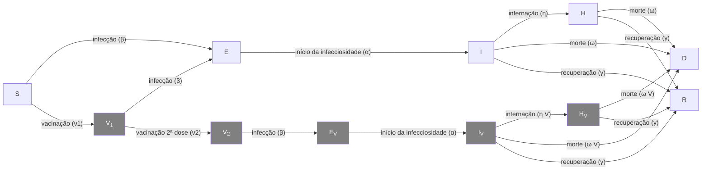

```{r setup, echo= FALSE, message = FALSE, warning = FALSE}
library(epidemics)
library(contactsurveys)
library(wpp2024)
library(tidyverse)

# semente oculta para saída estocástica estável na aula
set.seed(33)

survey_files <- contactsurveys::download_survey(
  survey = "https://doi.org/10.5281/zenodo.3874557",
  verbose = FALSE
)
survey_load <- socialmixr::load_survey(files = survey_files)

data(popAge1dt, package = "wpp2024")

uk_pop <- popAge1dt %>%
  dplyr::filter(name == "United Kingdom", year == 2020) %>%
  dplyr::select(lower.age.limit = age, population = pop) %>%
  dplyr::mutate(population = population * 1000)

contacts_byage <- socialmixr::contact_matrix(
  survey = survey_load,
  countries = "United Kingdom",
  age_limits = c(0, 15, 65),
  symmetric = TRUE,
  survey_pop = uk_pop
)

# preparar a matriz de contato
contacts_byage_matrix <- contacts_byage$matrix

# preparar o vetor demográfico
demography_vector <- contacts_byage$demography$population
names(demography_vector) <- rownames(contacts_byage_matrix)

# condições iniciais: um em cada 1 milhão está infectado
initial_i <- 1e-6
initial_conditions <- c(
  S = 1 - initial_i, E = 0, I = initial_i, R = 0, V = 0
)

# construir para todas as faixas etárias
initial_conditions <- matrix(
  rep(initial_conditions, dim(contacts_byage_matrix)[1]),
  ncol = 5, byrow = TRUE
)
rownames(initial_conditions) <- rownames(contacts_byage_matrix)

# preparar a população para modelar como afetada pela epidemia
uk_population <- epidemics::population(
  name = "UK",
  contact_matrix = contacts_byage_matrix,
  demography_vector = demography_vector,
  initial_conditions = initial_conditions
)

close_schools <- epidemics::intervention(
  name = "School closure",
  type = "contacts",
  time_begin = 50,
  time_end = 50 + 100,
  reduction = matrix(c(0.5, 0.01, 0.01))
)

mask_mandate <- epidemics::intervention(
  name = "mask mandate",
  type = "rate",
  time_begin = 40,
  time_end = 40 + 200,
  reduction = 0.163
)

# períodos de tempo
preinfectious_period <- 4.0
infectious_period <- 5.5
basic_reproduction <- 2.7

# taxas
infectiousness_rate <- 1.0 / preinfectious_period
recovery_rate <- 1.0 / infectious_period
transmission_rate <- basic_reproduction / infectious_period

output_baseline <- epidemics::model_default(
  population = uk_population,
  transmission_rate = transmission_rate,
  infectiousness_rate = infectiousness_rate,
  recovery_rate = recovery_rate,
  time_end = 300, increment = 1.0
)
```

::: {.callout-note title="Perguntas"}

- Como posso quantificar o efeito de uma intervenção?


:::

::: {.callout-tip title="Objetivos"}

- Comparar cenários de intervenção

:::

::: {.callout-important title="Pré-requisitos"}

+ Conclua os tutoriais [Simular a transmissão](02-simular-transmissao.qmd) e [Modelar intervenções](04-modelar-intervencoes.qmd)

Os participantes devem se familiarizar com os seguintes conceitos prévios antes de trabalhar neste tutorial:

**Resposta a surtos**: [Tipos de intervenção](https://www.cdc.gov/nonpharmaceutical-interventions/).

:::

## Introdução

Neste tutorial, compararemos cenários de intervenção entre si. Para quantificar o efeito de uma intervenção, precisamos comparar nosso cenário de intervenção com um cenário contrafactual (linha de base). O *contrafactual* aqui é o cenário no qual nada muda, frequentemente chamado de cenário de "não fazer nada". O cenário contrafactual pode apresentar:

- Nenhuma intervenção, ou
- Intervenções já existentes em vigor (caso estejamos investigando o impacto potencial de uma intervenção adicional)

Também precisamos definir nosso *desfecho de interesse* para fazer comparações entre os cenários de intervenção e contrafactual. O desfecho de interesse pode ser:

- Saídas diretas do modelo (por exemplo, número de infecções, internações)
- Métricas epidemiológicas (por exemplo, momento do pico epidêmico, tamanho final do surto)
- Medidas de impacto na saúde (por exemplo, Anos de Vida Ajustados por Qualidade [QALYs] ou Anos de Vida Ajustados por Incapacidade [DALYs])
- Medidas de impacto econômico (por exemplo, custos de assistência à saúde, perdas de produtividade)

::: {.callout-note title="No Brasil: medindo a pressão assistencial"}

Entre as medidas de impacto na saúde, as que a gestão do SUS usa no dia a dia são **internações** e
**ocupação de leitos de UTI**. As internações por SRAG estão no SIVEP-Gripe ([Portal de Dados Abertos do SUS — SIVEP-Gripe](https://dadosabertos.saude.gov.br/dataset/srag-2019-a-2026)) e as demais no
SIH/DATASUS; a oferta de leitos está cadastrada no CNES ([CNES](http://cnes.datasus.gov.br/)).

:::

Neste tutorial, aprenderemos como usar o pacote de R `{epidemics}` para comparar o efeito de diferentes intervenções em trajetórias simuladas de doenças. Usaremos o `{socialmixr}` para dados de contato social e o `{tidyverse}` (incluindo `{dplyr}`, `{ggplot2}` e o pipe `%>%`) para manipulação e visualização de dados.

```{r,message=FALSE,warning=FALSE}
library(epidemics)
library(socialmixr)
library(tidyverse)
```

::: {.callout-important title="Para o instrutor" collapse="true"}

Neste tutorial, apresentamos o conceito de contrafactual e como comparar cenários (contrafactual versus intervenção) entre si.

:::

## Visualizar o efeito das intervenções

Para comparar o cenário de linha de base com os cenários de intervenção, podemos criar visualizações do nosso desfecho de interesse. O desfecho de interesse pode ser simplesmente a saída do modelo ou uma medida agregada dessa saída.

Se quiséssemos investigar a mudança no pico epidêmico com a aplicação de uma intervenção, poderíamos traçar as trajetórias do modelo ao longo do tempo:
```{r}
output_baseline <- epidemics::model_default(
  population = uk_population,
  transmission_rate = transmission_rate,
  infectiousness_rate = infectiousness_rate,
  recovery_rate = recovery_rate,
  time_end = 300, increment = 1.0
)

output_school <- epidemics::model_default(
  # população
  population = uk_population,
  # taxa
  transmission_rate = transmission_rate,
  infectiousness_rate = infectiousness_rate,
  recovery_rate = recovery_rate,
  # intervenção
  intervention = list(contacts = close_schools),
  # tempo
  time_end = 300, increment = 1.0
)

# criar a coluna intervention_type para o gráfico
output_school$intervention_type <- "school closure"
output_baseline$intervention_type <- "baseline"
output <- rbind(output_school, output_baseline)

output %>%
  filter(compartment == "infectious") %>%
  ggplot() +
  aes(
    x = time,
    y = value,
    color = intervention_type,
    linetype = intervention_type
  ) +
  stat_summary(
    fun = "sum",
    geom = "line",
    linewidth = 1
  ) +
  scale_y_continuous(
    labels = scales::comma
  ) +
  geom_vline(
    xintercept = c(
      close_schools$time_begin,
      close_schools$time_end
    ),
    linetype = 2
  ) +
  theme_bw() +
  labs(
    x = "Simulation time (days)",
    y = "Individuals"
  )
```

Se quiséssemos quantificar o impacto da intervenção sobre a saída do modelo ao longo do tempo, poderíamos considerar o número acumulado de pessoas infecciosas no cenário de linha de base em comparação com o cenário de intervenção:

```{r}
output %>%
  filter(compartment == "infectious") %>%
  group_by(time, intervention_type) %>%
  summarise(value_total = sum(value), .groups = "drop_last") %>%
  group_by(intervention_type) %>%
  mutate(cum_value = cumsum(value_total)) %>%
  ggplot() +
  geom_line(
    aes(
      x = time,
      y = cum_value,
      color = intervention_type,
      linetype = intervention_type
    ),
    linewidth = 1.2
  ) +
  scale_y_continuous(
    labels = scales::comma
  ) +
  geom_vline(
    xintercept = c(
      close_schools$time_begin,
      close_schools$time_end
    ),
    linetype = 2
  ) +
  theme_bw() +
  labs(
    x = "Simulation time (days)",
    y = "Cumulative number of infectious individuals"
  )
```

### Modelo Vacamole

O modelo Vacamole é um modelo determinístico baseado em um sistema de equações diferenciais ordinárias (EDO) desenvolvido por [Ainslie et al. (2022)](https://doi.org/10.2807/1560-7917.ES.2022.27.44.2101090) para descrever o efeito da vacinação na dinâmica da COVID-19. O modelo é composto por 11 compartimentos, nos quais os indivíduos são classificados como:

+ Suscetíveis ($S$)
+ Parcialmente vacinados ($V_1$)
+ Totalmente vacinados ($V_2$)
+ Expostos ($E$) e expostos enquanto vacinados ($E_V$)
+ Infecciosos ($I$) e infecciosos enquanto vacinados ($I_V$)
+ Internados ($H$) e internados enquanto vacinados ($H_V$)
+ Mortos ($D$)
+ Recuperados ($R$)

O diagrama abaixo descreve o fluxo de indivíduos através dos diferentes compartimentos.



::: {.callout-tip .desafio title="Desafio"}

## Executar um cenário contrafactual usando o modelo Vacamole

1. Execute o modelo com os valores padrão dos parâmetros para a população do Reino Unido, assumindo que:

+ Um em cada um milhão de indivíduos (0,0001%) é infeccioso (e não vacinado) no início da simulação
+ A matriz de contato para o Reino Unido possui as seguintes faixas etárias:
  + 0-20 anos
  + 20-40 anos
  + 40+ anos

Para os seguintes cenários:

+ Linha de base: Programa de vacinação com duas doses
  - Dose 1 (taxa de vacinação 0,01) inicia a partir do dia 30
  - Dose 2 (taxa de vacinação 0,01) inicia a partir do dia 60
  - Ambos os programas funcionam por 300 dias
+ Intervenção: Obrigatoriedade do uso de máscaras
  - Inicia a partir do dia 60
  - Dura 100 dias
  - Reduz a taxa de transmissão em 16,3% (com base em estudos empíricos sobre a eficácia de máscaras)

Não há esquema de vacinação em vigor
2. Usando a saída, plote o número acumulado de óbitos ao longo do tempo

::: {.callout-note title="Dica" collapse="true"}

### DICA: Executar o modelo com valores padrão dos parâmetros

Podemos executar o modelo Vacamole com [valores padrão dos parâmetros](https://epiverse-trace.github.io/epidemics/articles/model_vacamole.html#model-epidemic-using-vacamole) apenas especificando o objeto de população e o número de passos de tempo para executar o modelo:

```{r, eval = FALSE}
output <- epidemics::model_vacamole(
  population = uk_population,
  time_end = 300
)
```

:::

::: {.callout-note .solucao title="Solução" collapse="true"}

1.  Executar o modelo

```{r, message = FALSE, warning = FALSE}
survey_files_uk <- contactsurveys::download_survey(
  survey = "https://doi.org/10.5281/zenodo.3874557",
  verbose = FALSE
)
survey_load_uk <- socialmixr::load_survey(files = survey_files_uk)

data(popAge1dt, package = "wpp2024")

uk_pop <- popAge1dt %>%
  dplyr::filter(name == "United Kingdom", year == 2020) %>%
  dplyr::select(lower.age.limit = age, population = pop) %>%
  dplyr::mutate(population = population * 1000)

contacts_byage_uk <- socialmixr::contact_matrix(
  survey = survey_load_uk,
  countries = "United Kingdom",
  age_limits = c(0, 20, 40),
  symmetric = TRUE,
  survey_pop = uk_pop
)
# preparar a matriz de contato
contacts_byage_matrix_uk <- contacts_byage_uk$matrix

# extrair o vetor demográfico
demography_vector <- contacts_byage_uk$demography$population
names(demography_vector) <- rownames(contacts_byage_matrix_uk)

# preparar as condições iniciais
initial_i <- 1e-6

initial_conditions_vacamole <- c(
  S = 1 - initial_i,
  V1 = 0, V2 = 0,
  E = 0, EV = 0,
  I = initial_i, IV = 0,
  H = 0, HV = 0, D = 0, R = 0
)

initial_conditions_vacamole <- rbind(
  initial_conditions_vacamole,
  initial_conditions_vacamole,
  initial_conditions_vacamole
)
rownames(initial_conditions_vacamole) <- rownames(contacts_byage_matrix_uk)

# preparar o objeto de população
uk_population_vacamole <- epidemics::population(
  name = "UK",
  contact_matrix = contacts_byage_matrix_uk,
  demography_vector = demography_vector,
  initial_conditions = initial_conditions_vacamole
)

# preparar dois objetos de vacinação
# vacinação dose 1
dose_1 <- epidemics::vaccination(
  name = "two-dose vaccination", # nome dado à primeira dose
  nu = matrix(0.01, nrow = 3),
  time_begin = matrix(30, nrow = 3),
  time_end = matrix(300, nrow = 3)
)

# preparar a segunda dose com intervalo de 30 dias na data de início
dose_2 <- epidemics::vaccination(
  name = "two-dose vaccination", # nome dado à primeira dose
  nu = matrix(0.01, nrow = 3),
  time_begin = matrix(30 + 30, nrow = 3),
  time_end = matrix(300, nrow = 3)
)

# usar `c()` para combinar as duas doses
double_vaccination <- c(dose_1, dose_2)

# executar o modelo de linha de base
output_baseline_vc <- epidemics::model_vacamole(
  population = uk_population_vacamole,
  vaccination = double_vaccination,
  time_end = 300
)

# criar a intervenção de máscara
mask_mandate <- epidemics::intervention(
  name = "mask mandate",
  type = "rate",
  time_begin = 60,
  time_end = 60 + 100,
  reduction = 0.163
)

# executar o modelo de intervenção
output_intervention_vc <- epidemics::model_vacamole(
  population = uk_population_vacamole,
  vaccination = double_vaccination,
  intervention = list(
    transmission_rate = mask_mandate
  ),
  time_end = 300
)

```

2. Plotar o número acumulado de óbitos ao longo do tempo

```{r}
# criar a coluna intervention_type para o gráfico
output_intervention_vc$intervention_type <- "mask mandate"
output_baseline_vc$intervention_type <- "baseline"
output_vacamole <- rbind(output_intervention_vc, output_baseline_vc)

output_vacamole %>%
  filter(compartment == "dead") %>%
  group_by(time, intervention_type) %>%
  summarise(value_total = sum(value), .groups = "drop_last") %>%
  group_by(intervention_type) %>%
  mutate(cum_value = cumsum(value_total)) %>%
  ggplot() +
  geom_line(
    aes(
      x = time,
      y = cum_value,
      color = intervention_type,
      linetype = intervention_type
    ),
    linewidth = 1.2
  ) +
  scale_y_continuous(
    labels = scales::comma
  ) +
  theme_bw() +
  labs(
    x = "Simulation time (days)",
    y = "Cumulative number of deaths"
  )

```

:::

:::

## Calcular desfechos evitados

Embora as visualizações sejam úteis para comparar cenários de intervenção ao longo do tempo, também precisamos de medidas quantitativas do impacto das intervenções. Uma dessas medidas é o número de infecções evitadas, o que nos ajuda a compreender a diferença entre os cenários de intervenção.

O pacote de R `{epidemics}` fornece a função `outcomes_averted()` para calcular as infecções evitadas levando em consideração a incerteza dos parâmetros. Vamos estender nosso exemplo de COVID-19 de [Modelar intervenções](04-modelar-intervencoes.qmd) para levar em conta a incerteza no número básico de reprodução ($R_0$).

```{r}
# períodos de tempo
preinfectious_period <- 4.0
infectious_period <- 5.5

# especificar a média e o desvio padrão de R0
r_estimate_mean <- 2.7
r_estimate_sd <- 0.05

# gerar 100 amostras de R
r_samples <- withr::with_seed(
  seed = 1,
  rnorm(
    n = 100, mean = r_estimate_mean, sd = r_estimate_sd
  )
)

beta <- r_samples / infectious_period

# taxas
infectiousness_rate <- 1.0 / preinfectious_period
recovery_rate <- 1.0 / infectious_period
```

Usamos esses valores de parâmetros juntamente com a estrutura populacional e a matriz de contato utilizadas em [Modelar intervenções](04-modelar-intervencoes.qmd) para executar o modelo no cenário de linha de base:

```{r}
output_baseline <- epidemics::model_default(
  population = uk_population,
  transmission_rate = beta,
  infectiousness_rate = infectiousness_rate,
  recovery_rate = recovery_rate,
  time_end = 300, increment = 1.0
)
```

Em seguida, criamos uma lista de todas as intervenções que desejamos incluir na nossa comparação. Definimos nossos cenários da seguinte forma:

+ cenário 1: fechamento de escolas
+ cenário 2: obrigatoriedade do uso de máscaras
+ cenário 3: fechamento de escolas e obrigatoriedade do uso de máscaras.

No R, especificamos isso como:
```{r}
intervention_scenarios <- list(
  scenario_1 = list(
    contacts = close_schools
  ),
  scenario_2 = list(
    transmission_rate = mask_mandate
  ),
  scenario_3 = list(
    contacts = close_schools,
    transmission_rate = mask_mandate
  )
)
```

Usamos essa lista como entrada para `intervention` em `model_default`

```{r}
output <- epidemics::model_default(
  uk_population,
  transmission_rate = beta,
  infectiousness_rate = infectiousness_rate,
  recovery_rate = recovery_rate,
  time_end = 300, increment = 1.0,
  intervention = intervention_scenarios
)
head(output)
```

Agora que temos as saídas do modelo para todos os nossos cenários, queremos comparar as saídas das intervenções com a nossa linha de base.

Podemos fazer isso usando `outcomes_averted()` no `{epidemics}`. Essa função calcula o tamanho final da epidemia para cada cenário e, em seguida, calcula o número de infecções evitadas em cada cenário em comparação com a linha de base. Para usar essa função, especificamos:

+ a saída do cenário de linha de base
+ as saídas do(s) cenário(s) de intervenção.

```{r}
intervention_effect <- epidemics::outcomes_averted(
  baseline = output_baseline, scenarios = output
)
intervention_effect
```

A saída nos fornece as infecções evitadas em cada cenário em comparação com a linha de base. Para obter as infecções evitadas no total geral, especificamos `by_group = FALSE`:

```{r}
intervention_effect <- epidemics::outcomes_averted(
  baseline = output_baseline, scenarios = output,
  by_group = FALSE
)
intervention_effect
```

::: {.callout-note title="Para se aprofundar"}

### Vinhetas do pacote

Recomendamos a leitura da vinheta sobre [Modelar respostas a uma epidemia estocástica pelo vírus Ebola](https://epiverse-trace.github.io/epidemics/articles/model_ebola.html) para usar um modelo compartimental estocástico em tempo discreto de Ebola, utilizado durante o surto de DVE na África Ocidental em 2014.

:::

::: {.callout-tip .desafio title="Desafio"}

## Desafio: Análise de surto de Ebola

Você recebeu a tarefa de investigar o impacto potencial de uma intervenção em um surto de Ebola na Guiné (por exemplo, uma redução nos contatos de risco com casos). Usando `model_ebola()` e as informações detalhadas abaixo, encontre o número de infecções evitadas quando:

+ uma intervenção é aplicada para reduzir a taxa de transmissão em 50% a partir do dia 60 e,
+ uma intervenção é aplicada para reduzir a transmissão em 10% a partir do dia 30.

Para ambas as intervenções, assumimos que há alguma incerteza sobre a taxa de transmissão de linha de base. Capturamos essa incerteza sorteando valores de uma distribuição normal com média = 1,1 / 12 (ou seja, $R_0=1.1$ e período infeccioso = 12 dias) e desvio padrão = 0,01.

*Nota: Dependendo do número de réplicas utilizadas, esta simulação pode levar vários minutos para ser executada.*

+ Tamanho da população: 14 milhões
+ Número inicial de indivíduos expostos: 10
+ Número inicial de indivíduos infecciosos: 5
+ Tempo de simulação: 120 dias+ Valores dos parâmetros:
  + $R_0$ (`r0`) = 1.1,
  + $p^I$ (`infectious_period`) = 12,
  + $p^E$ (`preinfectious_period`) = 5,
  + $k^E=k^I = 2$,
  + $1-p_{hosp}$ (`prop_community`) = 0.9,
  + $p_{ETU}$ (`etu_risk`) = 0.7,
  + $p_{funeral}$ (`funeral_risk`) = 0.5

::: {.callout-note .solucao title="Solução" collapse="true"}

```{r}
population_size <- 14e6

E0 <- 10
I0 <- 5
# preparar as condições iniciais como proporções
initial_conditions <- c(
  S = population_size - (E0 + I0), E = E0, I = I0, H = 0, F = 0, R = 0
) / population_size

# configurar o objeto de população
guinea_population <- population(
  name = "Guinea",
  contact_matrix = matrix(1), # nota: valor fictício
  demography_vector = population_size, # 14 milhões, sem faixas etárias
  initial_conditions = matrix(
    initial_conditions,
    nrow = 1
  )
)

# gerar 100 amostras de beta
beta <- withr::with_seed(
  seed = 1,
  rnorm(
    n = 100, mean = 1.1 / 12, sd = 0.01
  )
)

# executar a linha de base
output_baseline <- epidemics::model_ebola(
  population = guinea_population,
  transmission_rate = beta,
  infectiousness_rate = 2.0 / 5,
  removal_rate = 2.0 / 12,
  prop_community = 0.9,
  etu_risk = 0.7,
  funeral_risk = 0.5,
  time_end = 100,
  replicates = 100 # argumento replicates
)

# criar objetos de intervenção
reduce_transmission_1 <- epidemics::intervention(
  type = "rate",
  time_begin = 60, time_end = 100, reduction = 0.5
)

reduce_transmission_2 <- epidemics::intervention(
  type = "rate",
  time_begin = 30, time_end = 100, reduction = 0.1
)

# criar lista de intervenções
intervention_scenarios <- list(
  scenario_1 = list(
    transmission_rate = reduce_transmission_1
  ),
  scenario_2 = list(
    transmission_rate = reduce_transmission_2
  )
)

# executar o modelo
output_intervention <- epidemics::model_ebola(
  population = guinea_population,
  transmission_rate = beta,
  infectiousness_rate = 2.0 / 5,
  removal_rate = 2.0 / 12,
  prop_community = 0.9,
  etu_risk = 0.7,
  funeral_risk = 0.5,
  time_end = 100,
  replicates = 100, # argumento replicates,
  intervention = intervention_scenarios
)

# calcular desfechos evitados
intervention_effect <- epidemics::outcomes_averted(
  baseline = output_baseline, scenarios = output_intervention,
  by_group = FALSE
)
intervention_effect
```

**Nota: O número de infecções evitadas pode ser negativo. Isso ocorre porque a variação estocástica nas trajetórias da doença para uma dada taxa de transmissão pode resultar em um surto de tamanho diferente.**

:::
:::

::: {.callout-note title="Pontos-chave"}

- Um cenário contrafactual (linha de base) deve ser claramente definido para comparações significativas
- Os cenários podem ser comparados usando tanto visualizações quanto medidas quantitativas
- A função `outcomes_averted()` ajuda a quantificar os efeitos das intervenções
- A incerteza dos parâmetros deve ser considerada na análise de intervenções

:::
